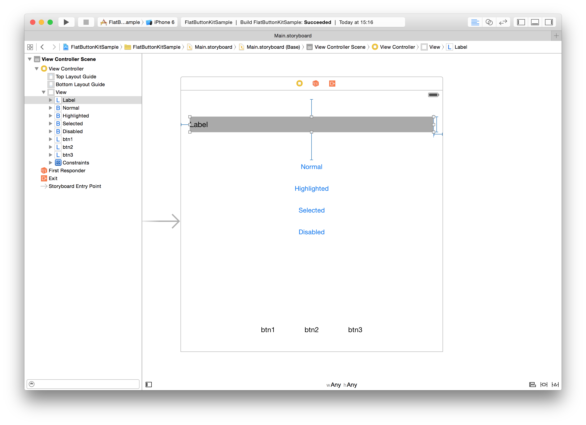
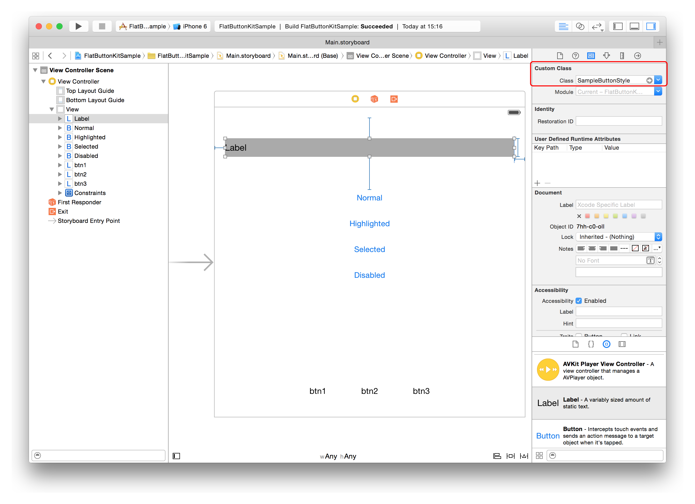
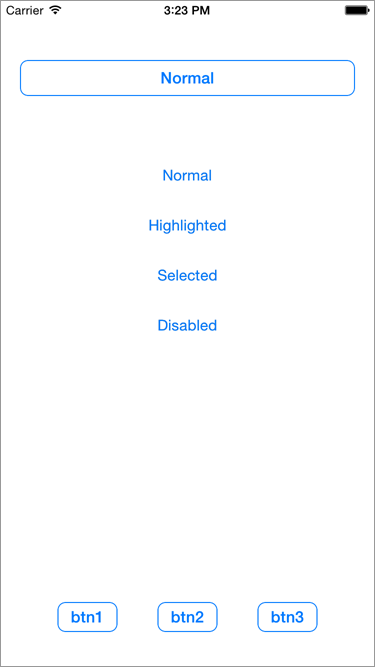

# FlatButtonKit

FlatButtonKit is written by Swift and make Flat Style Button from UILabel.

## Requirements
- Swift 4.0
- iOS 8.0 or later

## Installation

### Carthage

* Cartfile

```Cartfile
github "keygx/FlatButtonKit"
```
or

```Cartfile
github "keygx/FlatButtonKit" "branch-name"
```
or

```Cartfile
github "keygx/FlatButtonKit" "tag"
```

* install

```
$ carthage update
```
To integrate "FlatButtonKit.framework" into your Xcode project

### CocoaPods

* PodFile

```PodFile
source 'https://github.com/CocoaPods/Specs.git'
platform :ios, '8.0'
use_frameworks!

target '<Your Target Name>' do
    pod 'FlatButtonKit', :git => 'https://github.com/keygx/FlatButtonKit'
end
```
or

```PodFile
source 'https://github.com/CocoaPods/Specs.git'
platform :ios, '8.0'
use_frameworks!

target '<Your Target Name>' do
    pod 'FlatButtonKit', :git => 'https://github.com/keygx/FlatButtonKit', :branch => 'branch-name'
end
```
or

```PodFile
source 'https://github.com/CocoaPods/Specs.git'
platform :ios, '8.0'
use_frameworks!

target '<Your Target Name>' do
    pod 'FlatButtonKit', :git => 'https://github.com/keygx/FlatButtonKit', :tag => 'tag'
end
```

* install

```
$ pod install
```

## Usage

### Make Button Style

- Inherit FlatButtonKit class
- For more information: SampleButtonStyle.swift

```SampleButtonStyle.swift
import FlatButtonKit

~~

class SampleButtonStyle: FlatButtonKit {

	~~

	 override func setButtonStyle(status: ButtonStatus) {

	 	~~

		switch status {
		case .disabled:
	        // Disabled Style Stettings...

		case .highlighted:
	        // Highlight Style Stettings...

		case .selected:
	        // Selected Style Stettings...

		default:
	        // Normal Style Stettings...
		}
	}
}
```

###Layout UILabel



###Setting Custom Class



###Code written

```ViewController.swift

class ViewController: UIViewController {

	@IBOutlet weak var button: SampleButtonStyle!
  	@IBOutlet weak var btn1: SampleButtonStyle!
  	@IBOutlet weak var btn2: SampleButtonStyle!
  	@IBOutlet weak var btn3: SampleButtonStyle!

	override func viewDidLoad() {
		super.viewDidLoad()

		button.title.normal = "Normal"
        button.title.highlighted = "Highlighted"
        button.title.selected = "Selected"
        button.title.disabled = "Disabled"
        button.status = .normal
        button.tag = 1

		// set Touch Event
		button.setTarget(target: self, selector: #selector(didTapped(_:))) // -> func didTapped(sender:)

		or

		// set Click Handler
		button.setClickHandler() { sender in
			print("ClickHandler: \(sender.tag)")
		}
	}

	// Receive Touch Event
	@objc func didTapped(_ sender: Timer) {
        if let sender: AnyObject = sender.userInfo {
            print("didTapped: \(($0 as AnyObject).tag)")
        }
    }

	~~
}
```

###Run Application




## License

AlertHelperKit is released under the MIT license. See LICENSE for details.

## Author

Yukihiko Kagiyama (keygx) <https://twitter.com/keygx>
